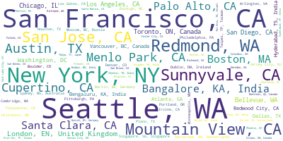

# Final Project: FAANG (Facebook Amazon Apple Netflix Google) Data Scientist Salary Predictor

## Overview
- Performed Analysis of over 15 different job salaries (their Minimum, Maximum and Average)
- Built Wordclouds for companies, job titles and locations
- Seperated the data for FAANG (Facebook Amazon Apple Netflix Google)
- Performed Analysis on the FAANG jobs (data scientist)
- Built a dashboard for both the analysis parts
- Engineered the features of the data to and built model using Multiple Line Regressor, Lasso Regressor (for different values of alpha) and Random Forest Regressor.
- Used GridsearchCV to find the best model
- Deployed the model locally using Flask

## Model Building

- Transformed the categorical variables into dummy variables. 
- Split the data into train and tests sets with a test size of 20%.

I tried three different models and evaluated them using Mean Absolute Error. I chose MAE because it is relatively easy to interpret and outliers aren’t particularly bad in for this type of model

- Linear Regression – Baseline for the model
- Lasso Regression – Tried to normalize the sparse data
- Random Forest – The Random Forest model far outperformed the other approaches on the test and validation sets

## Production
Built a flask API endpoint that was hosted on a local webserver by following along with the tutorial in the reference mentioned below. The API endpoint takes in a request with a list of values from a job listing and returns an estimated salary

## Resources Used and Referred

- Python Packages: Numpy, Pandas, Matplotlib, Wordcloud, Dash|Plotly, Scikit-Learn, Flask, Pickle, JSON

- Data (csv file): https://www.kaggle.com/jackogozaly/data-science-and-stem-salaries

- API using Flask: https://towardsdatascience.com/productionize-a-machine-learning-model-with-flask-and-heroku-8201260503d2

## Word Cloud Images (For the Overall dataset)

